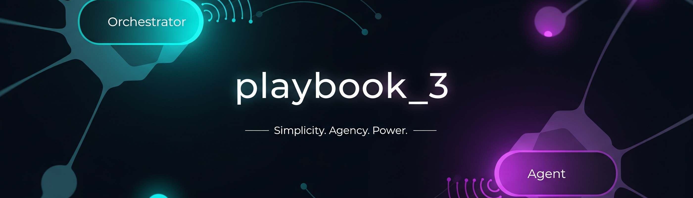
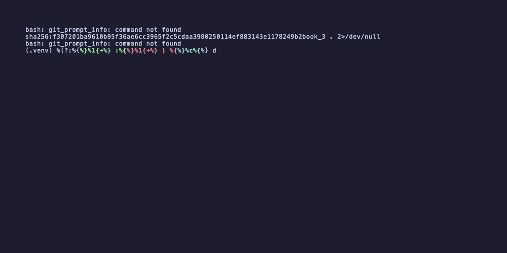
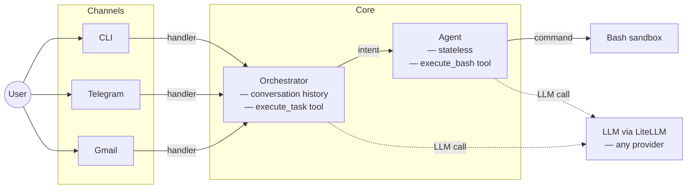

<p align="center">
  
</p>

<p align="center"><strong>Can a ~50-word system prompt and one tool produce genuine agency?</strong></p>

<p align="center">
  
</p>

## Architecture



## What Makes It Interesting

| | |
|---|---|
| **Two-tier LLM** | Orchestrator handles conversation; agent handles execution. Neither knows about the other's concerns. |
| **One tool each** | Orchestrator gets `execute_task`. Agent gets `execute_bash`. That's it. |
| **Swap any model** | Change one line in `config.yaml` — Claude, GPT-4, Kimi K2, Minimax, anything LiteLLM supports. |
| **Three channels, same interface** | CLI, Telegram, Gmail. Each is ~50 lines. Adding a new channel is one function. |
| **Eval built in** | Pit models against each other with LLM-as-judge scoring. |

## Try It

```bash
docker build -t playbook_3 .
docker run -it --env-file .env playbook_3
```

## Learn More

- [Architecture](docs/architecture.md) — component details, data flow, design decisions
- [Design Document](docs/plans/2026-02-23-minimal-agent-design.md) — original spec
- [Eval Results](docs/eval-results-2026-02-24.md) — model comparison data
